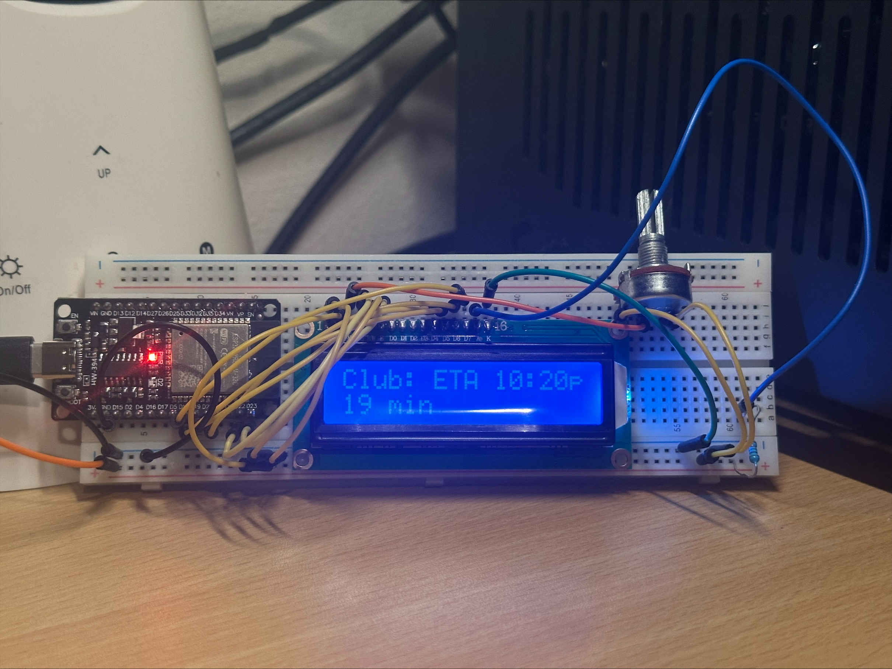

# Distance to POI Display

## Overview
A small ESP32 project that shows the **current travel time** and **estimated arrival time (ETA)** to a predefined point of interest (POI) on a 16×2 LCD. Useful as a desk or wall display for quick, at‑a‑glance commute info.

## How it works
The ESP32 connects to WiFi, queries the TomTom Routing API for live traffic data, and calculates both the travel duration and ETA using NTP time synchronization. The results are refreshed periodically and displayed on the LCD.

## Setup
1. Copy `secrets.example.h` to `secrets.h`
2. Fill in your actual credentials in `secrets.h`
3. Upload to your ESP32

## TODO:
- [X] Have important variables in non uploaded config files
- [X] Print time to destination to LCD
- [X] Print estimated arrival time to LCD
